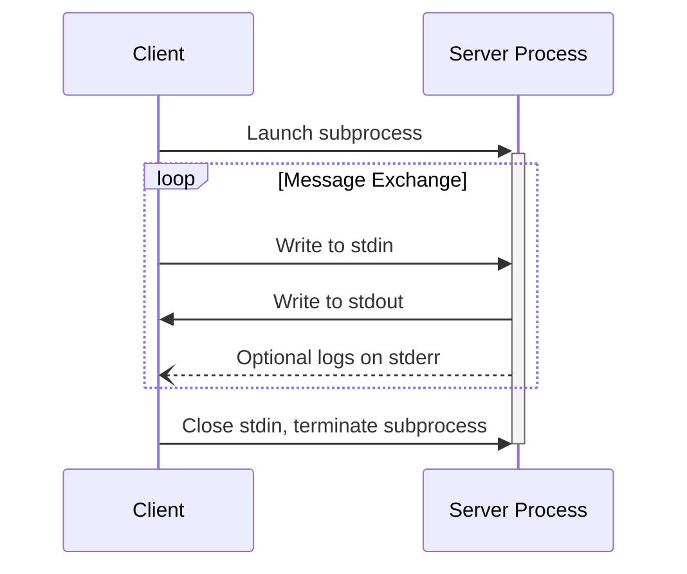

# 02 — stdio transport: stdout is sacred

## The model

For the stdio transport (what kafka-lens uses), the [spec's transport
section](https://modelcontextprotocol.io/specification/2025-06-18/basic/transports#stdio)
defines a strict subprocess contract:

> - The client launches the MCP server as a subprocess.
> - The server reads JSON-RPC messages from its standard input (`stdin`) and sends
>   messages to its standard output (`stdout`).
> - Messages are individual JSON-RPC requests, notifications, or responses.
> - Messages are delimited by newlines, and **MUST NOT** contain embedded newlines.
> - The server **MAY** write UTF-8 strings to its standard error (`stderr`) for logging
>   purposes. Clients **MAY** capture, forward, or ignore this logging.
> - The server **MUST NOT** write anything to its `stdout` that is not a valid MCP
>   message.

In short: **stdin = your input channel, stdout = the protocol channel, stderr = logs.**
Anything else written to stdout corrupts the message stream for the client.



## Lifecycle

1. Client spawns the server (e.g. `node dist/index.js`).
2. Client sends `initialize` (protocol version, capabilities).
3. Server answers `InitializeResult`; client sends `notifications/initialized`.
4. Normal traffic: `tools/list`, `tools/call`, … — each a single-line JSON message.
5. Client closes stdin → server sees EOF → process exits.

Observed in this repo's smoke tests: with stdin closed (`< /dev/null`), the server
exits with code **0** after startup — there is no daemon mode.

## How kafka-lens honors the contract

| Rule                        | How this repo complies (file)                                                                 |
| --------------------------- | --------------------------------------------------------------------------------------------- |
| No junk on stdout           | Every `console.log` is banned; the MCP SDK owns stdout exclusively                            |
| Logs go to stderr           | pino is created with `destination(2)` — `src/utils/logger.ts`                                 |
| Startup output must be tame | dotenv is loaded with `quiet: true` — `src/config/load-dotenv.ts` (see near-miss below)       |
| Single-line messages        | The SDK serializes envelopes; pretty-printed JSON lives _inside_ string values (escaped `\n`) |

### The dotenv near-miss

dotenv ≥17 prints a startup line by default:

```text
◇ injected env (2) from .env
```

That line goes to **stdout** — exactly where MCP messages must flow. Had we called
`dotenv.config()` without options, the very first line of our server's output would
have been garbage from the client's point of view. `config({ quiet: true })` prevents
it. This is also why a **stdout purity check** is part of our verification:

```bash
node dist/index.js < /dev/null > stdout.bin 2> stderr.log
wc -c < stdout.bin   # must be 0
```

## Message framing details

- One JSON object per line; the newline terminates the message.
- Pretty-printing a tool result is safe: `JSON.stringify(data, null, 2)` produces
  newlines _inside the `text` string value_, and JSON-escaping turns them into `\n`
  characters of the envelope — the bytes on the wire stay on one line.
- What is **not** safe: printing your own pretty-printed JSON-RPC envelope, adding
  banner/progress lines, or a stray `console.log` in a handler.

## Common stdio mistakes

| Mistake                              | Symptom                                                              |
| ------------------------------------ | -------------------------------------------------------------------- |
| `console.log` in tool handlers       | Client sees malformed JSON / fails to parse a message                |
| dotenv/morgan/etc. logging to stdout | Protocol desync, mysterious parse errors at startup                  |
| Multi-line envelope output           | Only the first line parses; the rest looks like garbage              |
| Writing to stdout from dependencies  | Same as above — audit transitive deps, prefer `quiet`/stderr options |
| Forgetting logs on stderr            | Works, but you lose all diagnostics — clients may ignore stderr      |
