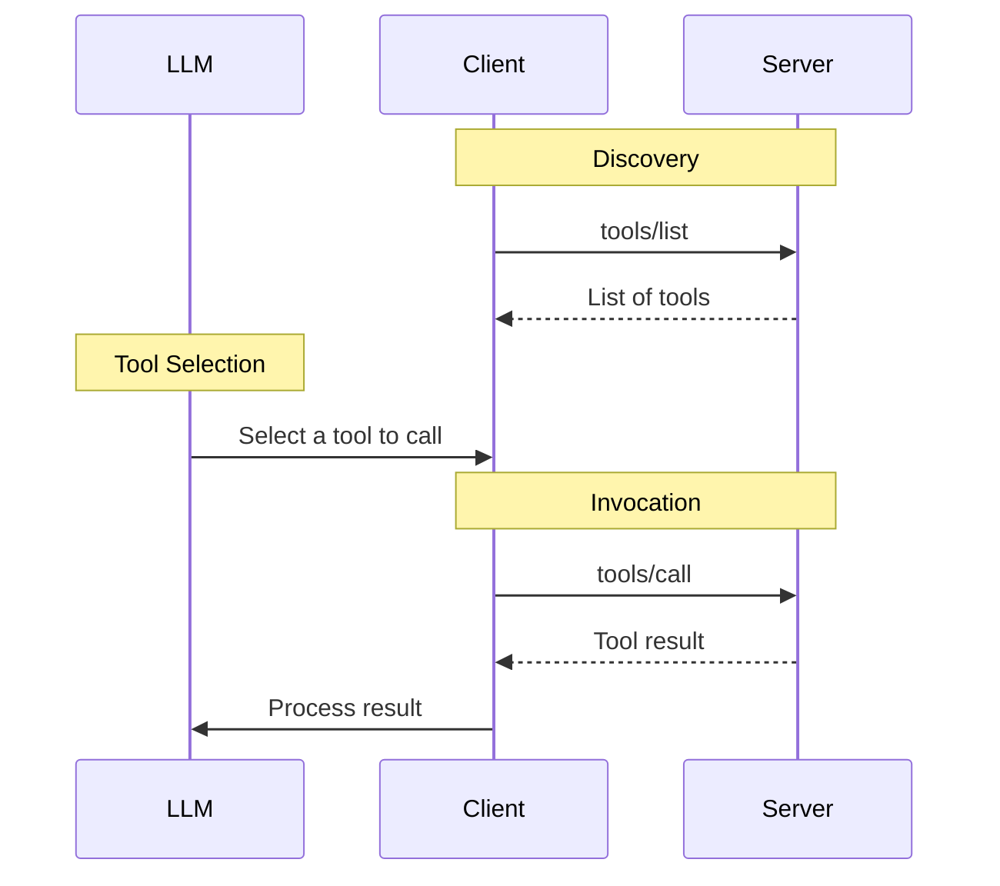

# 03 — Tools & the MCP Inspector workflow

## What a tool is

Tools are the request/response primitives of MCP and are **model-controlled**: the LLM
discovers them and decides when to call them. From the spec's [Tools
page](https://modelcontextprotocol.io/specification/2025-06-18/server/tools):

| Field          | Purpose                                                        |
| -------------- | -------------------------------------------------------------- |
| `name`         | Unique identifier used in `tools/call`                         |
| `title`        | Optional display name                                          |
| `description`  | What the model reads to decide whether/how to call the tool    |
| `inputSchema`  | JSON Schema of the arguments (client validates before calling) |
| `outputSchema` | Optional schema for structured results                         |
| `annotations`  | Behavioral hints (destructive, read-only, …) — untrusted       |

## Message flow



1. **Discovery** — client sends `tools/list`, server replies with the array of tool
   definitions (supports pagination via `cursor`).
2. **Invocation** — client sends `tools/call` with `{ name, arguments }`; server replies
   with a `CallToolResult` (`content` array + optional `isError` — see
   [note 01](01-error-handling.md)).

## How kafka-lens registers tools

- `src/server/mcp-server.ts` registers 5 tools via the MCP SDK's `registerTool`, passing
  **Zod raw shapes** as `inputSchema` — the SDK converts them to JSON Schema and
  validates every `tools/call` before our handler runs (schema violations become
  JSON-RPC `-32602`, layer 1 in note 01).
- Handlers live in `src/tools/` and are wrapped by the shared `executeTool` runner
  (`src/tools/run-tool.ts`) so every tool returns a uniform `CallToolResult`.

| Tool                 | Returns                                                     |
| -------------------- | ----------------------------------------------------------- |
| `health_check`       | Server liveness                                             |
| `get_cluster_info`   | Cluster id, controller, brokers (live)                      |
| `list_topics`        | Topic names + `total`/`truncated` flags, bounded by `limit` |
| `get_topic_metadata` | Partition count, per-partition leader/replicas/ISR          |
| `get_partition_info` | Per-partition leader/replicas/ISR + high/low watermarks     |

## Running it in MCP Inspector

The Inspector is both the **client** and the UI. Launching it with arguments makes it
start the server as a stdio subprocess (the model from [note 02](02-stdio-transport.md)):

```bash
npx @modelcontextprotocol/inspector node dist/index.js
```

Output:

```text
MCP Inspector Web is up and running at:
   http://127.0.0.1:6274?MCP_INSPECTOR_API_TOKEN=...
```

Open the tokenized URL (the token gates the Inspector's API). Useful areas:

| Area         | What it shows                                                  |
| ------------ | -------------------------------------------------------------- |
| **Servers**  | Transport config — stdio command/args/env vs a remote endpoint |
| **Tools**    | Tool list + a form per tool to build and send `tools/call`     |
| **Protocol** | Raw JSON-RPC messages both directions: method, timing, badges  |
| **Console**  | Client-side console output                                     |

### Reading the Protocol panel

- `CLIENT → SERVER` / `SERVER → CLIENT` rows show each JSON-RPC message.
- The green **OK** badge means the _JSON-RPC exchange_ succeeded — it does **not** mean
  the tool succeeded. Check the payload for `isError: true` (full explanation in
  [note 01](01-error-handling.md)).
- The middle **Results** panel renders the tool outcome and surfaces failures in red.

### Suggested exercise

1. Call `list_topics` — note the `tools/list` and `tools/call` messages in Protocol.
2. Call `get_topic_metadata` with `"topic": "does-not-exist"` — observe green OK badge,
   red Tool Error, and `isError: true` in the raw response.
3. Send a schema-invalid argument (e.g. `limit: 0.5` to `list_topics`) — observe this
   time the response is a JSON-RPC `error` (`-32602`), i.e. layer 1.
